# Activation Functions

Activation functions are a central part of every node in an artificial neural network. Since I came accross multiple variants and got confused sometimes, I put together this brief overview.

The repository includes a [notebook](https://github.com/siebenrock/activation-functions/blob/master/activation_functions.ipynb) with all functions implemented in Python and plots. Parametric ReLU is similar to Leaky ReLU but the coefficient of leakage is learned as a parameter of the neural network.

| Function | Plot | Equation | Derivative | Derivative plot
|----|:---:|:---:|:---:|:---:|
| Binary Step |  |  |  |
| Piecewise Linear |  |  |  |
| Bipolar |  |  |  |
| Sigmoid |  |  |  | 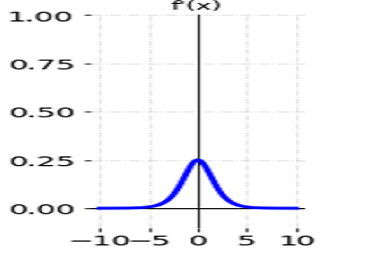 |
| Bipolar Sigmoid |  |  |  | 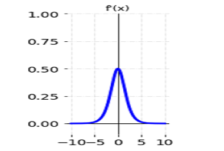 |
| Hyperbolic Tangent, TanH |  |  |  | 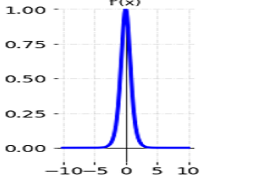 |
| Arctangent, ArcTan |  |   |   | 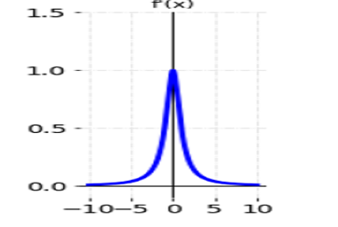 |
| Rectified Linear Units, ReLU |  |  |  | 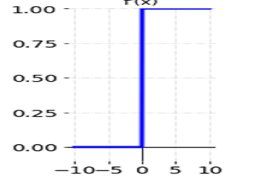 |
| Leaky Rectified Linear Units, Leaky ReLU |  |  |  | 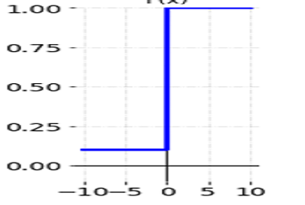 |
| Exponential Linear Units, ELU |  |  |  | 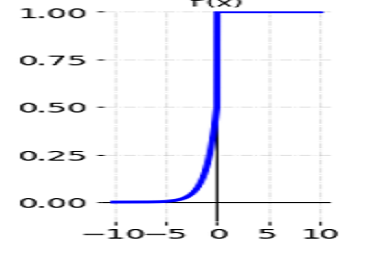 |
| SoftPlus |  |  |  | 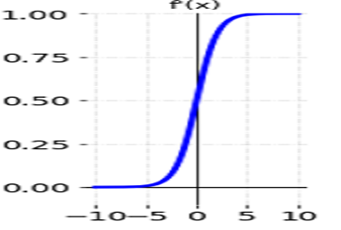 |
| Swish |  | 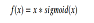 | 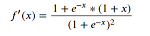 | 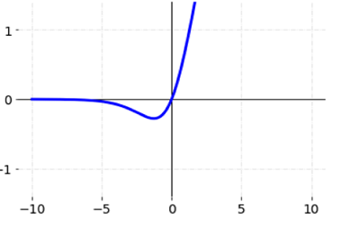 |
